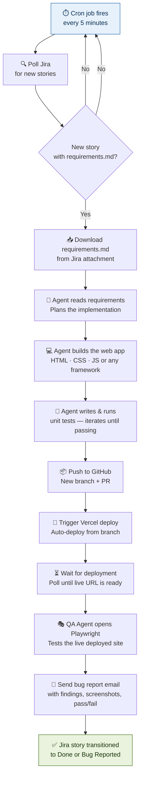

# Assignment — Zero Human Touch Pipeline
### Your ticket to the next deep dive

---

> **This is not a tutorial. There is no step-by-step guide.**
> That is deliberate.
> The engineers who figure this out are the ones we want in the room next time.

---

## What You Are Building

A fully automated, end-to-end software delivery pipeline.

A product manager drops a story into Jira with a requirements file attached.
From that moment, no human touches anything.
The pipeline builds the app, tests it, deploys it, verifies it, and reports back.



---

## The Jira Story Format

Every story you create to test your pipeline must follow this structure.

**Story title:** `[AI-PIPELINE] <short description>`

**Label:** `ai-ready` — this is what your cron job filters on

**Attachment:** a file named exactly `requirements.md`

**The `requirements.md` file describes the web app to build.** Keep it simple — a todo app, a weather card, a calculator, a landing page. The pipeline, not the app, is what you're being assessed on.

**Example `requirements.md`:**

```markdown
# Requirements — Simple Todo App

## What to build
A single-page web application that lets a user manage a todo list.

## Features
- Add a new todo item via a text input and a button
- Mark a todo as complete (strikethrough + visual indicator)
- Delete a todo item
- Show a count of remaining incomplete items
- Persist todos in localStorage so they survive a page refresh

## Tech
- Plain HTML, CSS, JavaScript — no framework required
- Single file output preferred (index.html)
- Must work in Chrome without any build step

## Acceptance criteria
- All 5 features work correctly
- No console errors on load or interaction
- Page is usable on a mobile screen (375px wide)
```

---

## Pipeline Specification

### Stage 1 — The Trigger

A cron job runs every 5 minutes and polls Jira for stories matching your filter.

**What to use:**
- A simple Python or Node script running on your machine via `cron`, `Task Scheduler`, or a tool like `node-cron`
- Or a lightweight server (FastAPI, Express) that runs the poll on an interval

**What it must do:**
- Authenticate with the Jira REST API
- Query for issues: `project = YOUR_PROJECT AND labels = ai-ready AND status = "To Do"`
- For each result, download the `requirements.md` attachment
- Transition the story to `In Progress` immediately (so it won't be picked up again on the next cron tick)
- Pass the story key and requirements content to the next stage

**Jira API endpoints you will need:**
```
GET  /rest/api/3/search?jql=...                  # Search for issues
GET  /rest/api/3/issue/{issueKey}/attachments     # List attachments
GET  /rest/api/3/attachment/content/{id}          # Download attachment
POST /rest/api/3/issue/{issueKey}/transitions     # Transition status
POST /rest/api/3/issue/{issueKey}/comment         # Add comment
```

---

### Stage 2 — Build

Your agent reads `requirements.md` and builds the web app.

**What to use:** Claude Code, Cursor, aider, or any agentic coding tool of your choice.

**What it must do:**
- Read the requirements in full before writing a single line of code
- Produce a working web app in an output directory
- Follow the tech stack specified in the requirements
- The output must be deployable to Vercel as-is (static site or framework project)

**The agent must not ask for clarification.** It must make reasonable decisions and build.

---

### Stage 3 — Unit Tests

Your agent writes and runs unit tests against the code it just produced.

**What it must do:**
- Write meaningful unit tests — not trivial ones
- Run the tests programmatically
- If tests fail, the agent reads the failure output, fixes the code, and re-runs
- This loop continues until all tests pass
- The final test results must be saved to a file: `test-results.txt`

**This stage must be fully automated.** No human reads the failures. The agent does.

---

### Stage 4 — Push to GitHub

**What it must do:**
- Initialise a git repo (or use an existing one)
- Create a new branch named: `feature/JIRA-KEY-short-description`
- Commit all output files with a meaningful commit message
- Push the branch to GitHub
- Open a Pull Request — title must include the Jira story key

**What to use:** GitHub REST API, PyGitHub, or the GitHub CLI (`gh`)

---

### Stage 5 — Deploy to Vercel

**What it must do:**
- Trigger a Vercel deployment from the pushed branch
- Poll the Vercel API until the deployment status is `READY`
- Extract the live deployment URL
- Pass the URL to the next stage

**Vercel API endpoints you will need:**
```
POST /v13/deployments                            # Trigger deployment
GET  /v13/deployments/{id}                       # Poll deployment status
```

**The pipeline must not proceed to testing until the URL is confirmed live.**
Add a health check: `curl` the URL and verify it returns a `200`.

---

### Stage 6 — QA Agent via Playwright

A separate agent launches and tests the live deployed site.

**What it must do:**
- Open the deployed URL in a real browser via Playwright
- Test every acceptance criterion listed in `requirements.md`
- Take a screenshot of each key state (initial load, after interaction, any errors)
- Capture any browser console errors or JavaScript exceptions
- Produce a structured bug report

**Bug report format — `bug-report.md`:**
```markdown
# QA Report — JIRA-KEY
**Deployment URL:** https://...
**Tested at:** 2025-05-07 14:32 UTC
**Overall status:** PASS / PARTIAL / FAIL

## Test Results
| Acceptance Criterion | Result | Notes |
|----------------------|--------|-------|
| Add a todo item      | ✅ PASS |       |
| Mark as complete     | ❌ FAIL | Checkbox click does nothing |
| ...                  | ...    | ...   |

## Console Errors
- None / list errors here

## Screenshots
- screenshot-01-initial-load.png
- screenshot-02-after-add.png

## Summary
Plain English summary of what works, what doesn't, and severity.
```

---

### Stage 7 — Email the Bug Report

**What it must do:**
- Send an email to a specified address with:
  - Subject: `QA Report — JIRA-KEY — PASS / FAIL`
  - Body: the contents of `bug-report.md`
  - Attachments: all screenshots taken by the Playwright agent
- Use SendGrid, Resend, Nodemailer, or Python's `smtplib` — your choice

---

### Stage 8 — Close the Loop in Jira

**What it must do:**
- If all tests passed: transition the story to `Done`, add a comment with the deployment URL and a summary
- If any tests failed: transition the story to `Bug Reported` (or `In Review`), add the full bug report as a comment
- Either way, the story must never be left in `In Progress` — the pipeline always closes what it opens

---

## Constraints

These are not suggestions.

- **No human intervention at any stage.** If you have to manually click anything after creating the Jira story, the pipeline is incomplete.
- **The cron job must run unattended.** It should work while you sleep.
- **Every stage must handle failure gracefully.** If the build fails, if the deploy fails, if Playwright crashes — the pipeline must catch the error, log it, and update Jira accordingly. Silent failures are disqualifying.
- **The Jira story must always end in a terminal state.** Done or Bug Reported. Never stuck in progress.

---

## What to Submit

Send a Loom recording (or equivalent screen recording) that shows:

1. You creating a Jira story with a `requirements.md` attached, then stepping away from the keyboard
2. The cron job picking up the story — show the logs
3. The agent building the app — show it running
4. The GitHub PR being opened — show it in GitHub
5. The Vercel deployment going live — show the URL
6. The Playwright agent running against the live site — show the browser
7. The bug report email arriving in an inbox
8. The Jira story in its final state — Done or Bug Reported

**No recording, no invitation.**

---

## Stack Suggestions

You are free to use any tools. These are the ones most likely to get you there fastest.

| Stage | Suggested tools |
|-------|----------------|
| Cron | `node-cron` · Python `schedule` · `cron` (Linux/Mac) |
| Jira polling | Jira REST API v3 + `requests` or `axios` |
| Agent / build | Claude Code · aider · Cursor |
| Unit tests | Jest · Vitest · pytest · whichever fits your output |
| GitHub | `gh` CLI · PyGitHub · GitHub REST API |
| Vercel deploy | Vercel REST API · `vercel` CLI |
| Playwright | `@playwright/test` · Playwright MCP |
| Email | Resend · SendGrid · `nodemailer` · `smtplib` |
| Orchestration | A single Python or Node script that calls each stage in sequence |

---

**Deadline:** 18th May
**Submit to:** your manager via Loom link + GitHub repo link, and CC me on the email
